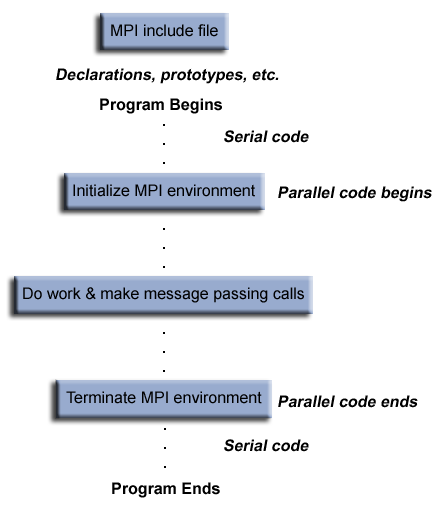
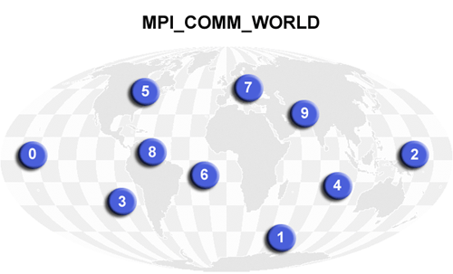

#### General MPI Program Structure:

#### Header File:

Required for all programs that make MPI library calls.

<table style="border-collapse:collapse;border-spacing:0" class="tg"><thead><tr><th style="background-color:#98ABCE;border-color:black;border-style:solid;border-width:1px;font-family:Arial, sans-serif;font-size:14px;font-weight:bold;overflow:hidden;padding:10px 5px;position:-webkit-sticky;position:sticky;text-align:center;top:-1px;vertical-align:middle;will-change:transform;word-break:normal"> C include file     </th><th style="background-color:#98ABCE;border-color:black;border-style:solid;border-width:1px;font-family:Arial, sans-serif;font-size:14px;font-weight:bold;overflow:hidden;padding:10px 5px;position:-webkit-sticky;position:sticky;text-align:center;top:-1px;vertical-align:middle;will-change:transform;word-break:normal">     Fortran include file     </th></tr></thead><tbody><tr><td style="border-color:black;border-style:solid;border-width:1px;font-family:Arial, sans-serif;font-size:14px;font-weight:bold;overflow:hidden;padding:10px 5px;text-align:left;vertical-align:top;word-break:normal">#include "mpi.h" </td><td style="border-color:black;border-style:solid;border-width:1px;font-family:Arial, sans-serif;font-size:14px;font-weight:bold;overflow:hidden;padding:10px 5px;text-align:left;vertical-align:top;word-break:normal">include 'mpif.h'</td></tr></tbody></table>

With MPI-3 Fortran, the `USE mpi_f08` module is preferred over using the include file shown above.

#### Format of MPI Calls:

C names are case sensitive; Fortran names are not.

Programs must not declare variables or functions with names beginning with the prefix `MPI_` or `PMPI_` (profiling interface).
<table style="border-collapse:collapse;border-spacing:0" class="tg"><thead><tr><th style="background-color:#98ABCE;border-color:black;border-style:solid;border-width:1px;font-family:Arial, sans-serif;font-size:14px;font-weight:bold;overflow:hidden;padding:10px 5px;position:-webkit-sticky;position:sticky;text-align:center;top:-1px;vertical-align:middle;will-change:transform;word-break:normal" colspan="2">C Binding</th></tr></thead><tbody><tr><td style="background-color:#F0F5FE;border-color:black;border-style:solid;border-width:1px;font-family:Arial, sans-serif;font-size:14px;font-weight:bold;overflow:hidden;padding:10px 5px;text-align:left;vertical-align:top;word-break:normal">Format:</td><td style="border-color:black;border-style:solid;border-width:1px;font-family:Arial, sans-serif;font-size:14px;font-weight:bold;overflow:hidden;padding:10px 5px;text-align:left;vertical-align:top;word-break:normal">rc = MPI_Xxxxx(parameter, ... ) </td></tr><tr><td style="background-color:#F0F5FE;border-color:black;border-style:solid;border-width:1px;font-family:Arial, sans-serif;font-size:14px;font-weight:bold;overflow:hidden;padding:10px 5px;text-align:left;vertical-align:top;word-break:normal">Example:</td><td style="border-color:black;border-style:solid;border-width:1px;font-family:Arial, sans-serif;font-size:14px;font-weight:bold;overflow:hidden;padding:10px 5px;text-align:left;vertical-align:top;word-break:normal">rc = MPI_Bsend(&amp;buf,count,type,dest,tag,comm)</td></tr><tr><td style="background-color:#F0F5FE;border-color:black;border-style:solid;border-width:1px;font-family:Arial, sans-serif;font-size:14px;font-weight:bold;overflow:hidden;padding:10px 5px;text-align:left;vertical-align:top;word-break:normal">Error code:</td><td style="border-color:black;border-style:solid;border-width:1px;font-family:Arial, sans-serif;font-size:14px;overflow:hidden;padding:10px 5px;text-align:left;vertical-align:middle;word-break:normal">Returned as "rc". MPI_SUCCESS if successful</td></tr><tr><td style="background-color:#98ABCE;border-color:black;border-style:solid;border-width:1px;font-family:Arial, sans-serif;font-size:14px;font-weight:bold;overflow:hidden;padding:10px 5px;text-align:center;vertical-align:middle;word-break:normal" colspan="2">Fortran Binding</td></tr><tr><td style="background-color:#F0F5FE;border-color:black;border-style:solid;border-width:1px;font-family:Arial, sans-serif;font-size:14px;font-weight:bold;overflow:hidden;padding:10px 5px;text-align:left;vertical-align:top;word-break:normal">Format:</td><td style="border-color:black;border-style:solid;border-width:1px;font-family:Arial, sans-serif;font-size:14px;font-weight:bold;overflow:hidden;padding:10px 5px;text-align:left;vertical-align:top;word-break:normal">CALL MPI_XXXXX(parameter,..., ierr) call mpi_xxxxx(parameter,..., ierr) </td></tr><tr><td style="background-color:#F0F5FE;border-color:black;border-style:solid;border-width:1px;font-family:Arial, sans-serif;font-size:14px;font-weight:bold;overflow:hidden;padding:10px 5px;text-align:left;vertical-align:top;word-break:normal">Example:</td><td style="border-color:black;border-style:solid;border-width:1px;font-family:Arial, sans-serif;font-size:14px;font-weight:bold;overflow:hidden;padding:10px 5px;text-align:left;vertical-align:top;word-break:normal">CALL MPI_BSEND(buf,count,type,dest,tag,comm,ierr)</td></tr><tr><td style="background-color:#F0F5FE;border-color:black;border-style:solid;border-width:1px;font-family:Arial, sans-serif;font-size:14px;font-weight:bold;overflow:hidden;padding:10px 5px;text-align:left;vertical-align:top;word-break:normal">Error code:</td><td style="border-color:black;border-style:solid;border-width:1px;font-family:Arial, sans-serif;font-size:14px;overflow:hidden;padding:10px 5px;text-align:left;vertical-align:middle;word-break:normal">Returned as "ierr" parameter. MPI_SUCCESS if successful</td></tr></tbody></table>

#### Communicators and Groups:

MPI uses objects called communicators and groups to define which collection of processes may communicate with each other.

Most MPI routines require you to specify a communicator as an argument.

Communicators and groups will be covered in more detail later. For now, simply use `MPI_COMM_WORLD` whenever a communicator is required - it is the predefined communicator that includes all of your MPI processes.

#### Rank:

Within a communicator, every process has its own unique, integer identifier assigned by the system when the process initializes. A rank is sometimes also called a "task ID". Ranks are contiguous and begin at zero.

Used by the programmer to specify the source and destination of messages. Often used conditionally by the application to control program execution (if rank=0 do this / if rank=1 do that).

#### Error Handling:

Most MPI routines include a return/error code parameter, as described in the "Format of MPI Calls" section above.

However, according to the MPI standard, the default behavior of an MPI call is to abort if there is an error. This means you will probably not be able to capture a return/error code other than MPI_SUCCESS (zero).

The standard does provide a means to override this default error handler. A discussion on how to do this is available [HERE](https://computing.llnl.gov/tutorials/mpi/errorHandlers.pdf). You can also consult the error handling section of the relevant MPI Standard documentation located at http://www.mpi-forum.org/docs/.

The types of errors displayed to the user are implementation dependent.
